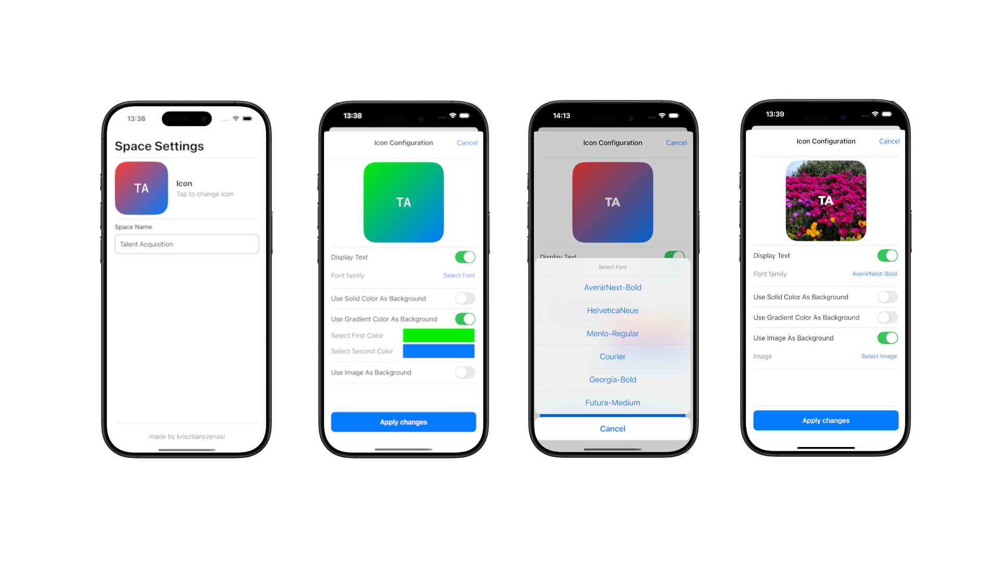

# CraftIcons

---

## Overview

For this project, I designed a reusable logo component that can display initials over a solid color, a gradient background, or a user-selected image. The app it self tries to mimic a hypotetical section of the craft appliaction for a space settings from where the configuration panel can be launched.

## About The Resuseable Icon

As mentioned, I aimed to make the icon highly customizable while avoiding visually unappealing results. To that end, I limited the initials to a maximum of 4 characters. A possible future enhancement could include predefined font size presets such as `.small`, `.medium`, and `.large `that scale relative to the icon’s size.

From a technial point of view the component is actually made up from three subcomponents. The first one is a dynamic label  on which the font family size and color can be adjusted. The second one is custom colored view which can be set to either a solid or a gradient color. The last one is a simple image view.

The icon and all of its subcomponents have configuration classes which can make it simple to copy or even save the configuration.

This approach allows room for future enhancements, such as adding a striped background, without compromising compatibility with the current implementation.

## About The Custom Color View

Initially, I planned to implement this as a simple extension of `UIColor`, but I ran into limitations (particularly with gradients) so I decided to use a standalone `UIView` instead.

The goal was to make it highly customizable while keeping the interface simple. The current gradient setup allows you to specify a list of colors, which are evenly distributed across the gradient, and an `enum` to define the direction (e.g., `.topToBottom`, `.topLeftToBottomRight`).

The solid version is just a simple background on the view.

This colored view is versatile and can be reused beyond just the icon component.

## About The Demo

As mentioned earlier, the purpose of the application is to showcase potential uses of the icon while exposing some customization options to the user. To keep the experience simple and avoid overwhelming the user, I intentionally left out several available settings. Currently, only a limited set of fonts is selectable, the font size is fixed, and font color customization is not available.

For color settings, users can choose almost any color using a `UIColorPickerViewController`. The only restriction is that the gradient direction is fixed to `.topLeftToBottomRight`.

These limitations were intentional to streamline the experience and make it easy to explore the component and get a feel for how it works. They can easily be removed or expanded upon in a more advanced version.

For the UI, I took inspiration from the screenshot provided in the task description, which led to a design that resembles a standard Apple application. To enhance clarity and better define sections (similar to the reference image) I added subtle gray separators between components.

## **Room for Improvement**

From a UI perspective, there’s certainly potential to introduce additional background styles for the icon, such as striped themes or other patterns. When it comes to font customization, the current implementation allows for a wide range of options. However, a key question is how much control we want to offer the user. I originally considered using presets—like predefined gradient color pairs that visually work well—but ultimately chose to let users select their own colors to encourage personalization.

On the technical side, some refactoring would definitely be beneficial. While I tried to maintain structure as I incrementally developed the app, the configuration logic ended up more complex than intended. The icon is currently configured through a single config class, but communication between components became a bit tangled. Introducing a shared or global state could simplify things, reducing the need to pass config data deeply through the UI hierarchy.

Lastly, since I primarily worked with SwiftUI and have only limited experience with UIKit and storyboards, some of my implementation choices may not follow typical UIKit conventions. Nonetheless, my main focus was to build a functional product, and I believe that goal was successfully achieved.

## **How the Icon Style Could Be Stored Permanently**

As mentioned earlier, the icon component relies on a configuration class that holds all the necessary styling information. To persist this configuration, it could be saved locally on the device or remotely via backend support. A common pattern for handling media files in such cases is the *valet key* approach—where the backend doesn’t directly store the media but instead provides signed URLs for a media storage service. This allows the client to upload and retrieve images independently, keeping the backend lightweight and focused on managing metadata or permissions.

# How would I test the application?

I’ve already performed some manual testing by interacting with all parts of the application to ensure each component behaves as expected. One important aspect was testing on different device sizes (I used an iPhone 16 Pro and an iPhone SE 3) to cover both large and small screen scenarios. Particular attention was given to features like toggling background options, where only one type (solid, gradient, or image) should be active at a time. These interactions were tested to ensure they properly deactivate the others as intended.